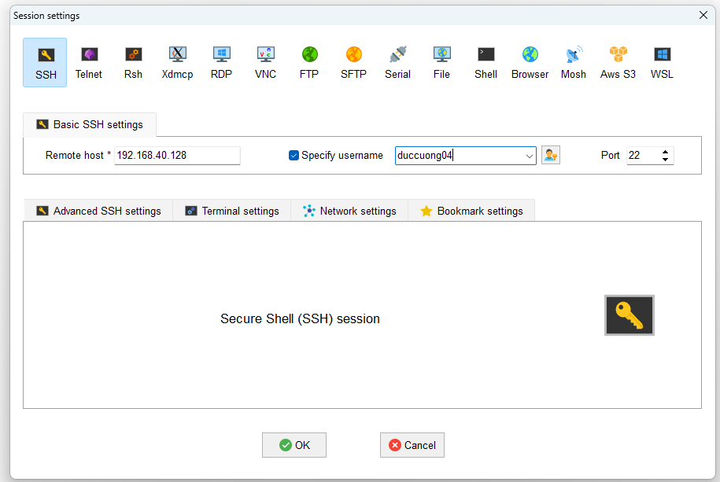
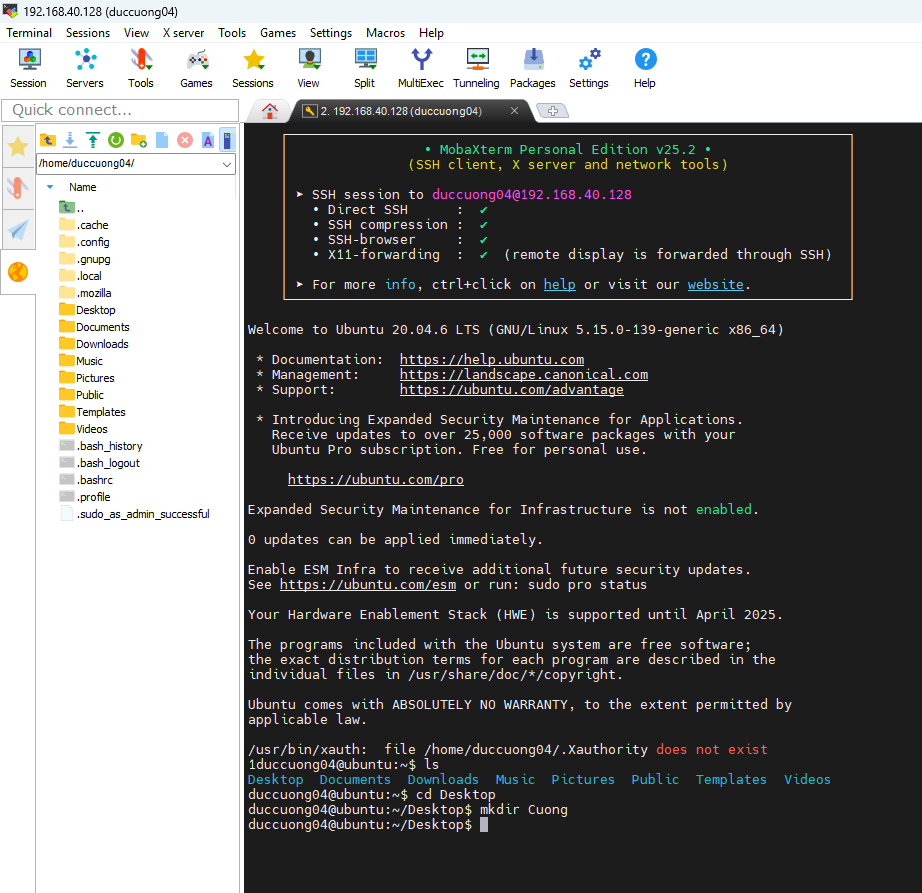
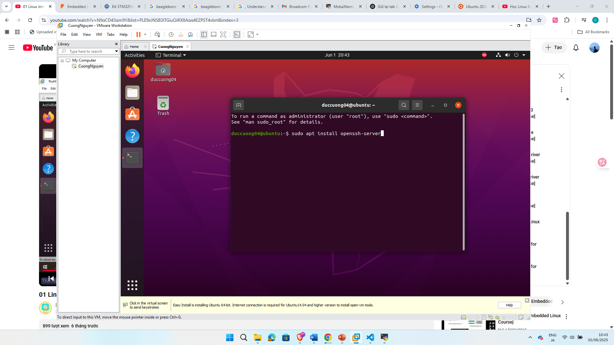
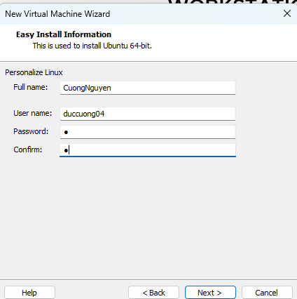
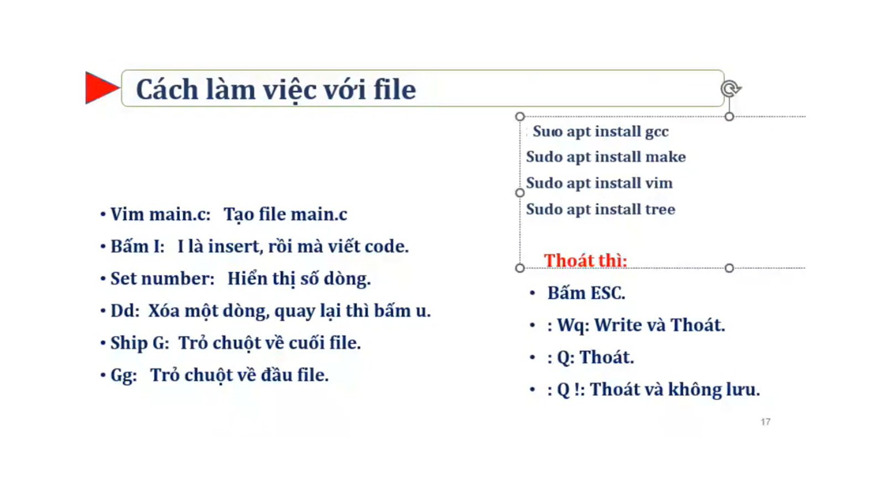
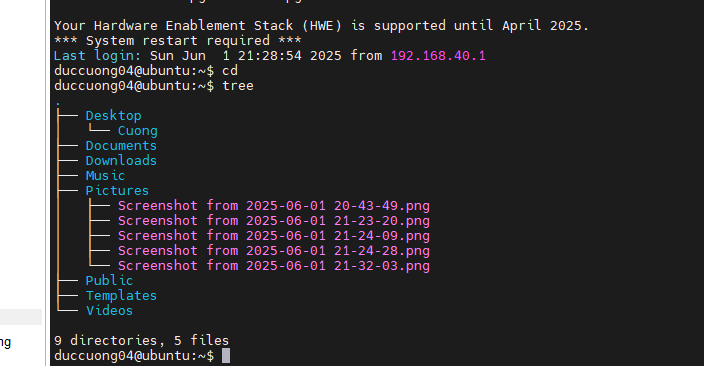
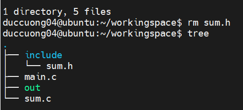

# Setup

## 1. Software
Ubuntu 20.04

https://releases.ubuntu.com/focal/

VNWare WorkStation

https://www.vmware.com/products/desktop-hypervisor/workstation-and-fusion

MobaXtern SSH

https://mobaxterm.mobatek.net/download-home-edition.html

## 2. Network Protocol

### 2.1 - SSH  
- SSH (Secure Shell) is a network protocol used to securely connect to and control remote computers over the internet or a local network. It allows users to log into another computer and execute commands as if they were sitting in front of it.  
    - Secure Communication: Encrypts all data (unlike older protocols like Telnet).
    - Remote Access: Control servers/computers from anywhere.
    - File Transfer: Supports secure file transfer via SCP or SFTP.
    - Tunneling & Port Forwarding: Can secure other connections (like database access).
### 2.2 - SFTP
- SFTP (Secure File Transfer Protocol) is a secure way to transfer files between computers over a network. It works like FTP (File Transfer Protocol) but with encryption, making it much safer.
    - SFTP runs over SSH (Secure Shell), so all file transfers are encrypted.
    - You need an SFTP client (software) to connect to an SFTP server and transfer files.

### 2.3. Connect VM
(SSH)

`sudo apt install openssh-server`

`sudo apt install net-tools`

`ifconfig` to view IP address of Ubuntu Server

In MobaXtern -> Session -> SSH -> Enter IP of Unbuntu to remote Host & username

Test: Enter command in MobaXtrern -> Create folder -> View in Ubuntu host

### 3. Install library, driver để chạy .c, makefile, vim edit file, open file,tree folder, enter command at MobaXterm

Tree

### 4. Familiar command line in Linux, build one file & programs in command line

#### 4.1. Build one file
- Create cuong.c

- `gcc -o out cuong.c`

- `./out`

#### 4.2. Build files

- Create

`gcc -o out2 main.c sum.c -I include/`

`./out2`
