```c #!/bin/bash
🔹 Shebang: Chỉ định chương trình shell để chạy script này là Bash.
```
```
Debug Website: https://www.shellcheck.net/
```

## 0. How to edit files on Ubuntu host by VsCode

- In VMware workstation -> VM -> Settings -> Options -> Shared Folder

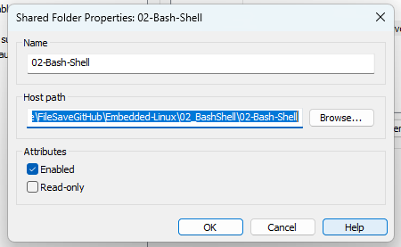

- Enter files that are needed in Windows

- Start Virtual Machine Ubuntu -> Mount folder `sudo mount -t fuse.vmhgfs-fuse .host:/02-Bash-Shell ~/Assignment/02-Bash-Shell -o allow_other
`

- Done!

## 1. Quyền của File

- Làm việc với BashScript, lưu ý về quyền của file - xem slide

1 số lệnh để set quyền cho File:

`ls -l`: xem quyền của các file (user, group, other)

`chmod 777 aaa.txt`: set quyền cho file (user, group, other) - rwx 

`chmod o+r aaa.txt`: thêm quyền read cho file

`chmod u-r aaa.txt`: bỏ quyền read

## 2. PATH

- Trong BashScript, phải đi đến thư mục thì mới build được các file trong đó

- PATH giúp thay đổi đều này, đứng ở đâu cũng có thể build file mình cần được. Chỉ cần thêm đường dẫn file cần build vào PATH

- Ví dụ ta có file 01_cuong.sh nằm trong folder TestPath

`echo $PATH`: Xem Path


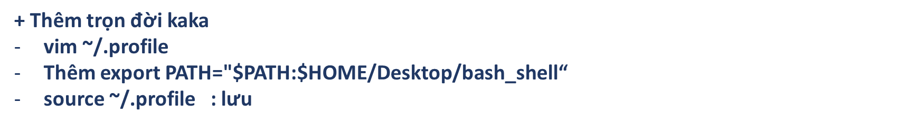

- Lưu ý `echo $HOME` để biết HOME đang = gì

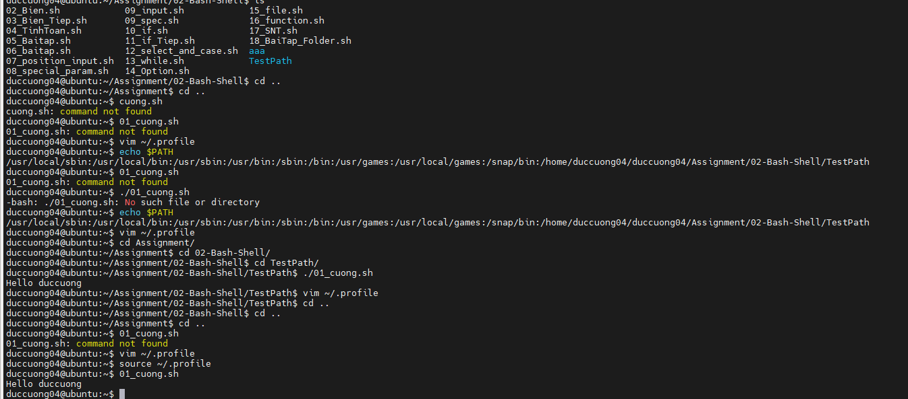

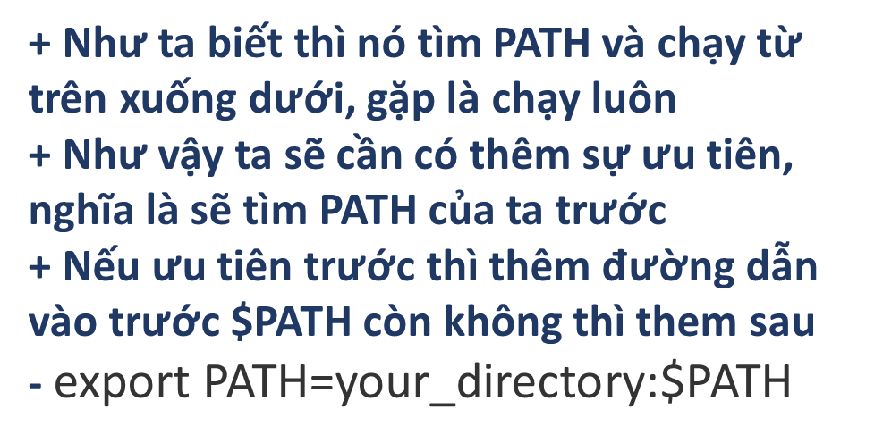

## 3. Variable

- Biến tự tạo

- Biến mặc định trong Linux

- Biến có màu 

- Chuyển chữ viết hoa thành thường và ngược lại

- Cắt chuỗi: parameter:offset:length

- Lấy đầu ra của biến và gán

## 4. Tính toán

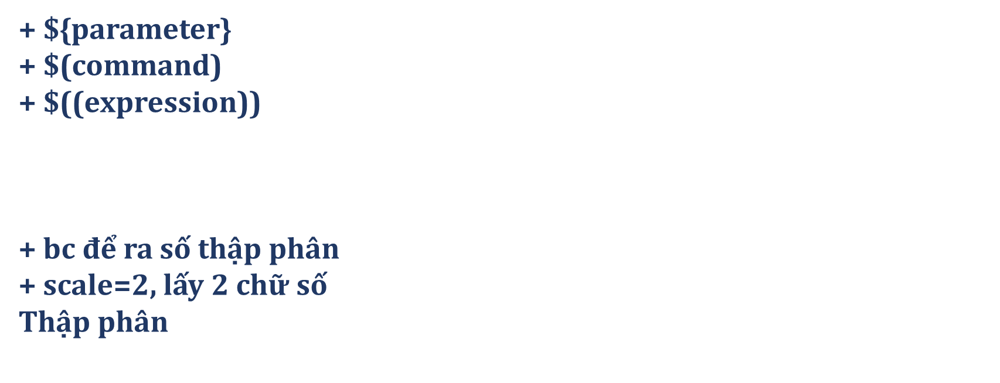

## 5. Kí tự đặc biệt


## 6. Các bước chạy command line (câu lệnh nhập vào)


- Tokenisation: nhận ra các toán tử và từ trong command, nơi command bắt đầu và kết thúc

- Command indentification: nhận ra đâu là command, đối số dựa vào toán tử điều khiển kết thúc dòng lệnh

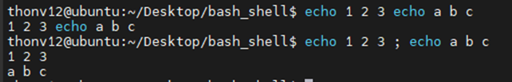

- Shell expansions: 4 giai đoạn để thực hiện mở rộng câu lệnh


    - Word splitting: các kí hiệu nhận diện tách được lưu trong biến IFS và có thể thay đổi được

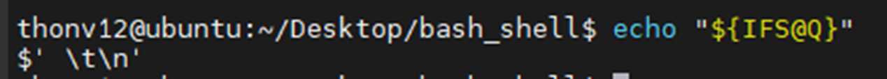

    - Globbing
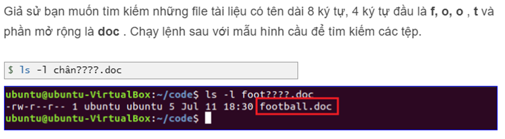

    - Xong 4 giai đoạn trên chuyển sang bước tiếp theo

- Redirection

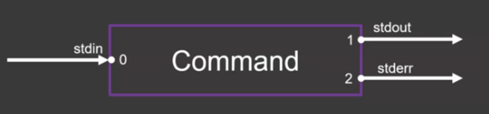


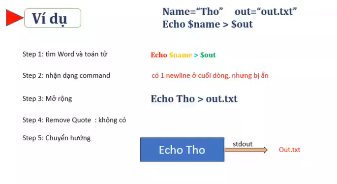

## 7. Position Input

- Khi nhập command: ./07_position_input cuong abc?

## 8. Special Parameters

## 9. Input - Read command

## 10. Toán tử điều kiện

- Điều kiện biến

- Điều kiện file

- if else

## 11. Select case (tương đương Switch Case trong C,..)

- Lấy option từ bàn phím

## 12. While

## 13. Array

- Xem chỉ số của mảng

- Xem giá trị của từng phần tử trong mảng

- Tạo mảng từ file - dùng ReadArray

## 14. Funtion

- Định nghĩa hàm nên thêm chữ funtion ở đầu để phân biệt

- Truyền biến - position_unput

- Biến toàn cục, biến cục bộ trong Bash

- Kiểu trả về

  - Chỉ có return về 0, khác với C

  - Muốn trả về thì return biến gobal hoặc stdout (nên dùng)

 - Cách gọi 1 hàm ra cũng khác, chỉ cần gọi tên hàm, k có 2 dấu ()

## 15. Bài tập

### 01. 


- B1: Bash nhận diện từ và toán tử

  - echo -> command

  - "$name" -> arguent (word)

  - > -> toán tử chuyển hướng (redirection: ghi đè file)

- B2: nhận dạng command `echo`

- B3: chú ý giai đoạn tách từ, tuy IFS được tách dấu chấm nhưng $name nằm trong dấu ngoặc kép

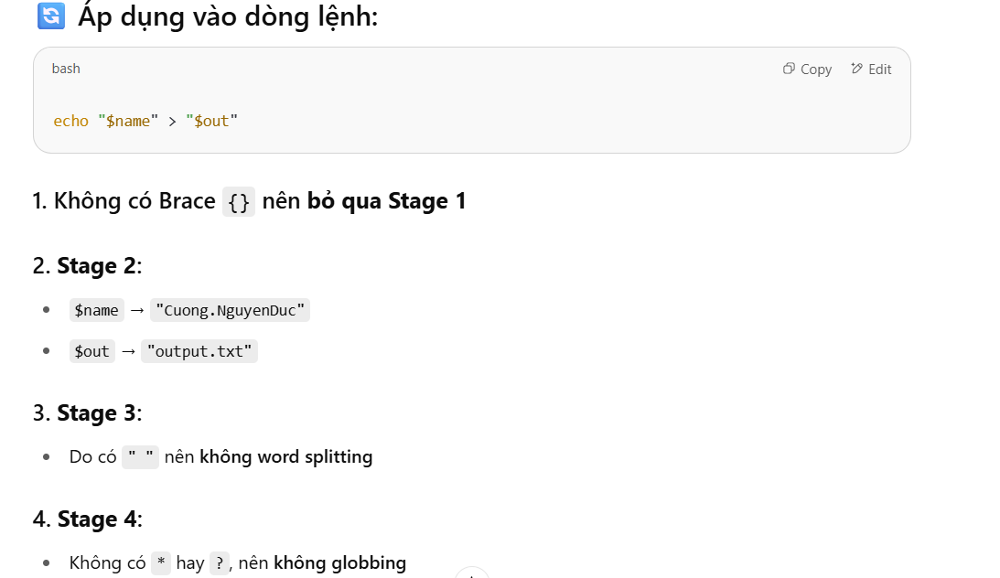

- B4: Remove Quote: Vì dùng double quotes ("), Bash giữ nguyên nội dung biến (không tách theo IFS).
→ Do đó, không có bước remove quote ảnh hưởng ở đây.

- B5: Redirection: Toán tử > được xử lý

### 02. 

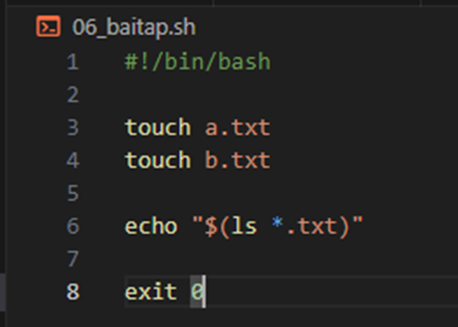

- `*.txt → globbing`
Shell sẽ mở rộng *.txt thành danh sách file có đuôi .txt, ví dụ: a.txt b.txt.

- $(ls *.txt) → command substitution
Shell chạy lệnh trong $(...) → ls a.txt b.txt

Kết quả là chuỗi a.txt b.txt

- "..." (double quotes)
Đảm bảo giữ nguyên toàn bộ kết quả thành một chuỗi duy nhất.

### 03. 

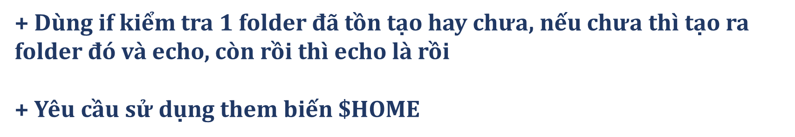

```c
#!/bin/bash

# Tên thư mục cần kiểm tra/ tạo
FOLDER_NAME="myfolder"
FULL_PATH="$HOME/$FOLDER_NAME"

# Kiểm tra xem folder tồn tại chưa
if [ -d "$FULL_PATH" ]; then
    echo "Đã tồn tại"
else
    mkdir "$FULL_PATH"
    echo "Đã tạo thư mục '$FULL_PATH'"
fi

```


